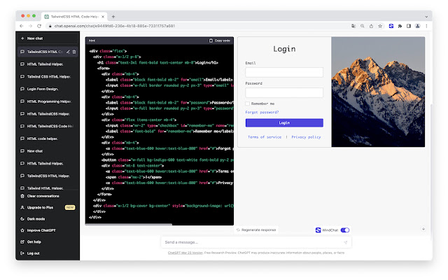

# Disable eslint rule with one click

move cursor to eslint warning, then press `command + .(dot)`

Source code:

https://github.com/WooodHead/disable-eslint-rule-vscode

# CodeXP.io
Search in 180M open source javascript projects.

https://codexp.io/npm/1/react,redux,passport

# TODO
[ ] Shortcut

[ ] More eslint config file format, rc/json/js ...

[ ] tslint

# WindChat - ChatGPT TailwindCSS HTML Previewer

https://chrome.google.com/webstore/devconsole/bc648ec4-1675-45f6-96a6-93ec942c93ec/ipafbgdehdljgphjgfmpkohhbelebdhm/analytics/impressions

# CodeXP.link
Search in 180M open source javascript projects.

https://codexp.link

